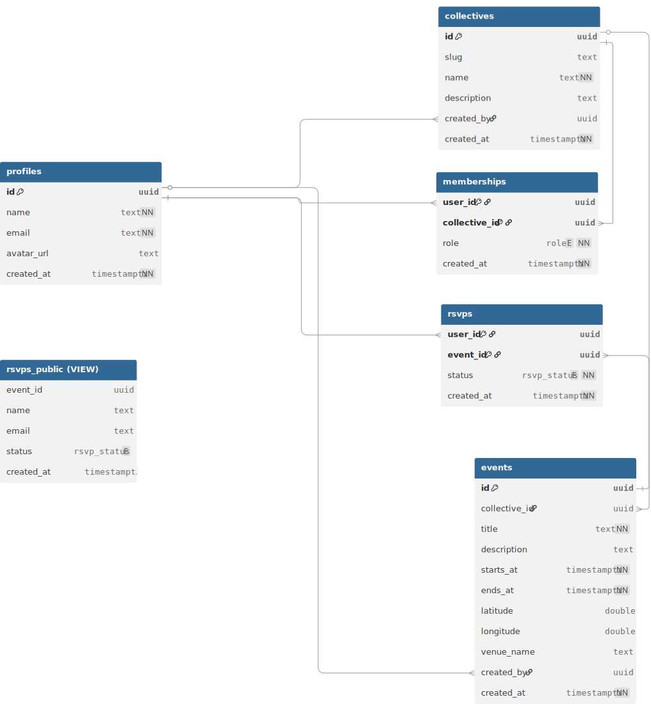

# 📊 Database Schema — Collectivezz

This document describes the **database schema** for Collectivezz — a community platform where collectives host events and people can RSVP.

The schema is designed for **Supabase (Postgres + RLS)** and focuses on:
- Keeping data normalized (profiles, collectives, memberships, events, RSVPs).
- Enforcing access rules via **Row-Level Security (RLS)**.
- Exposing public info (names, events) while keeping private data (emails) restricted.

---

## 🗺️ ER Diagram

Here’s a visual overview of the schema:



---

## 🧱 Core Entities

### **profiles**
- Represents each authenticated user (1 row per `auth.user`).
- Stores display name, email, avatar.
- `id` is always equal to `auth.uid()`.

### **collectives**
- Groups (formal or informal) that host events.
- Created by a user (linked via `created_by`).
- Identified with a unique `slug` for clean URLs.

### **memberships**
- Links a user to a collective with a **role** (`admin` or `member`).
- Composite primary key `(user_id, collective_id)` ensures uniqueness.
- Used for permission checks (only admins can manage events & memberships).

### **events**
- Belong to a collective.
- Have time (`starts_at`, `ends_at`), location (`latitude`, `longitude`, `venue_name`).
- Created by an admin.

### **rsvps**
- Links a user to an event with a status (`interested`, `cancelled`).
- Composite primary key `(user_id, event_id)` ensures one RSVP per user per event.
- Publicly visible, but only **admins** see emails.

### **rsvps_public (VIEW)**
- Derived view combining `rsvps` + `profiles`.
- Shows **names to everyone**.
- Shows **emails only to admins** of the event’s collective.

---

## 📋 DBML (for dbdiagram.io)

```dbml
Project Collectivezz {
  database_type: "PostgreSQL"
}

Enum role {
  admin
  member
}

Enum rsvp_status {
  interested
  cancelled
}

Table profiles {
  id uuid [pk]
  name text
  email text [unique]
  avatar_url text
  created_at timestamptz

  Note: '1 row per user; synced from auth.users'
}

Table collectives {
  id uuid [pk]
  slug text [unique]
  name text
  description text
  created_by uuid
  created_at timestamptz
}

Table memberships {
  user_id uuid
  collective_id uuid
  role role
  created_at timestamptz

  indexes {
    (user_id, collective_id) [pk]
  }
}

Table events {
  id uuid [pk]
  collective_id uuid
  title text
  description text
  starts_at timestamptz
  ends_at timestamptz
  latitude double
  longitude double
  venue_name text
  created_by uuid
  created_at timestamptz

  indexes {
    collective_id
    starts_at
  }
}

Table rsvps {
  user_id uuid
  event_id uuid
  status rsvp_status
  created_at timestamptz

  indexes {
    (user_id, event_id) [pk]
    event_id
  }
}

Table "rsvps_public (VIEW)" {
  event_id uuid
  name text
  email text // NULL unless admin
  status rsvp_status
  created_at timestamptz
}

Ref: collectives.created_by > profiles.id
Ref: memberships.user_id > profiles.id
Ref: memberships.collective_id > collectives.id
Ref: events.collective_id > collectives.id
Ref: events.created_by > profiles.id
Ref: rsvps.user_id > profiles.id
Ref: rsvps.event_id > events.id
```
---
## 📋 SQL (for postgres/supabase)
```
-- Enums
create type role as enum ('admin', 'member');
create type rsvp_status as enum ('interested', 'cancelled');

-- Profiles
create table if not exists profiles (
  id uuid primary key default auth.uid(),
  name text not null default '',
  email text not null unique,
  avatar_url text,
  created_at timestamptz not null default now()
);

-- Collectives
create table if not exists collectives (
  id uuid primary key default gen_random_uuid(),
  slug text unique,
  name text not null,
  description text,
  created_by uuid references profiles(id) on delete set null,
  created_at timestamptz not null default now()
);

-- Memberships
create table if not exists memberships (
  user_id uuid not null references profiles(id) on delete cascade,
  collective_id uuid not null references collectives(id) on delete cascade,
  role role not null default 'member',
  created_at timestamptz not null default now(),
  primary key (user_id, collective_id)
);

-- Events
create table if not exists events (
  id uuid primary key default gen_random_uuid(),
  collective_id uuid not null references collectives(id) on delete cascade,
  title text not null,
  description text,
  starts_at timestamptz not null,
  ends_at timestamptz not null,
  latitude double precision,
  longitude double precision,
  venue_name text,
  created_by uuid references profiles(id) on delete set null,
  created_at timestamptz not null default now()
);

-- RSVPs
create table if not exists rsvps (
  user_id uuid not null references profiles(id) on delete cascade,
  event_id uuid not null references events(id) on delete cascade,
  status rsvp_status not null,
  created_at timestamptz not null default now(),
  primary key (user_id, event_id)
);

-- Public RSVP view (names for all, emails only for admins)
create or replace view public.rsvps_public as
select
  r.event_id,
  p.name,
  case
    when exists (
      select 1 from memberships m
      join events e on e.collective_id = m.collective_id
      where e.id = r.event_id
        and m.user_id = auth.uid()
        and m.role = 'admin'
    )
    then p.email
    else null
  end as email,
  r.status,
  r.created_at
from rsvps r
join profiles p on p.id = r.user_id;
```